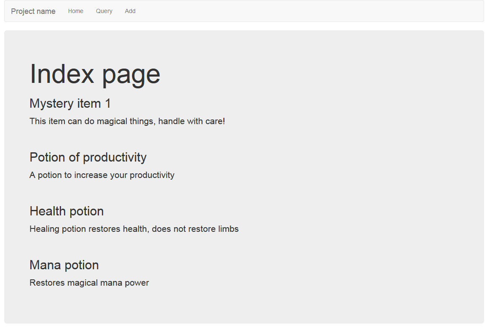
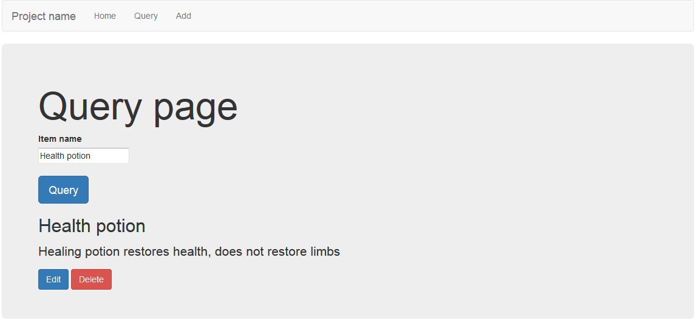
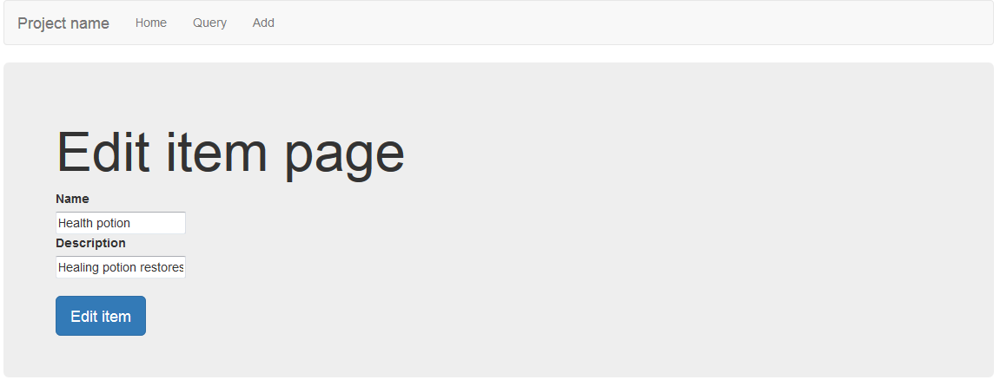

Basic-crud-flask
================
Basic-crud-flask is a simple app made to perform basic crud operations on a database, includes bootstrap. Can be used as a base app to build on.

Flask extensions used:

	* Flask-SQLAlchemy
	* Flask-WTF

Install
-------
Its advised that you use virtualenv or equivalent.

To setup the virtual python environment and activate it:

	virtualenv venv
	. venv/bin/activate

Download and install requirements:

	clone the repository
	pip install -r requirements.txt

Database setup
-------------------
SQLite is used as default for development, any DB can be swapped in that uses SQLAlchemy.

To create the DB run the create-database.py file:

	python create-database.py

Running the app
---------------
Once the database is created run the run.py file to start the development server, then just browse to the serverip using port 5000:

	python run.py
	http://serverip:5000/

Screenshots
-----------
Index page - queries all items in the database and displays them

Add item page - adds a simple item to the database

Query page - query the DB for items, edit or delete them

Edit page - edit item details

