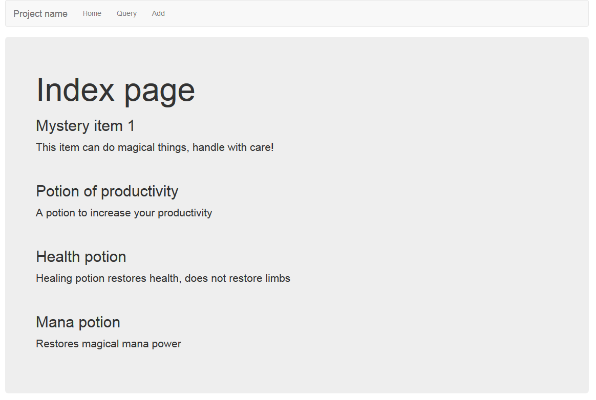
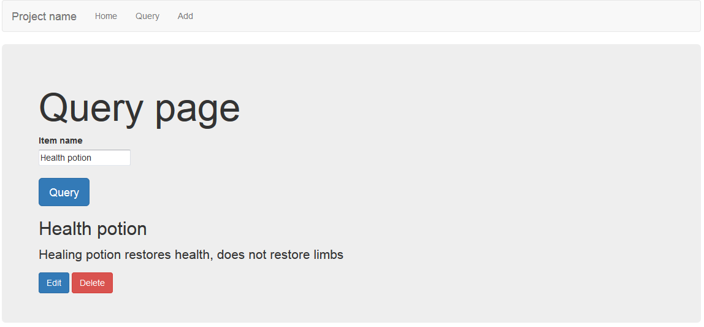
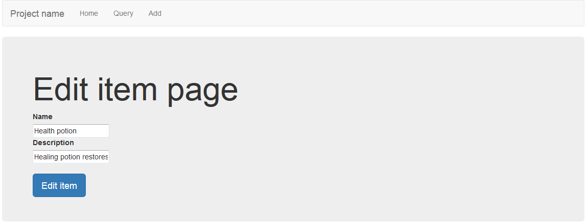

Basic-crud-flask
================
Basic-crud-flask is a simple app made to perform basic crud operations on a database. Can be used as a base app to build on.

Install
-------
Clone the repository, then create the virtual environment and install requirements:

	uv venv
	uv pip install -r requirements.txt

Or use a devcontainer with dockerfile

Configuration
-------------
The app reads its Flask secret key from a `.env` file (loaded via python-dotenv), which must
be created before running the app or creating the database. Copy the example file and fill in
a generated key:

	cp .env.example .env
	python -c "import secrets; print(secrets.token_hex(32))"

Paste the generated value into `.env` as `SECRET_KEY=...`. This file is gitignored and should
never be committed.

Database setup
-------------------
SQLite is used as default for development, any DB can be swapped in that uses SQLAlchemy.

To create the DB run the create-database.py file:

	uv run python create-database.py

Running the app
---------------
Once the database is created run the run.py file to start the development server, then just browse to the serverip using port 5000:

	uv run python run.py
	http://serverip:5000/

Screenshots
-----------
Index page - queries all items in the database and displays them

Add item page - adds a simple item to the database

Query page - query the DB for items, edit or delete them

Edit page - edit item details

